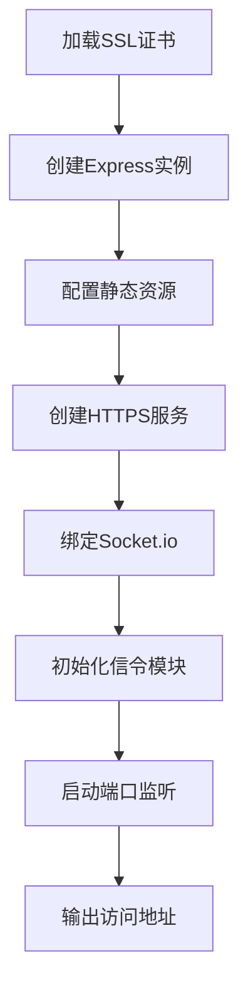
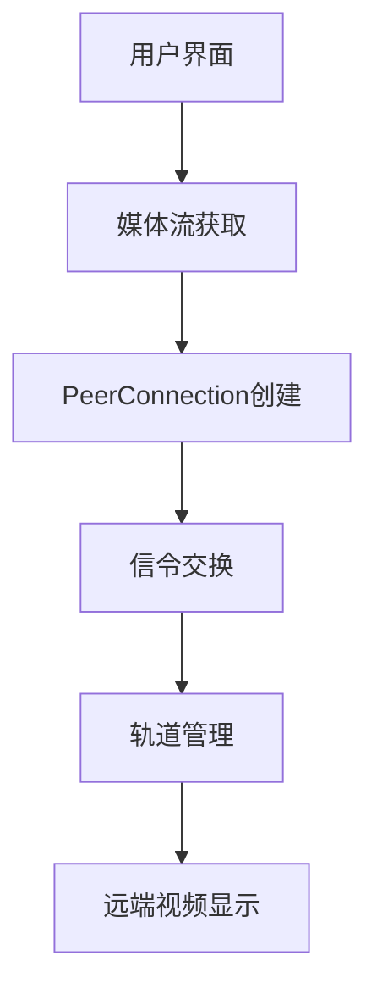
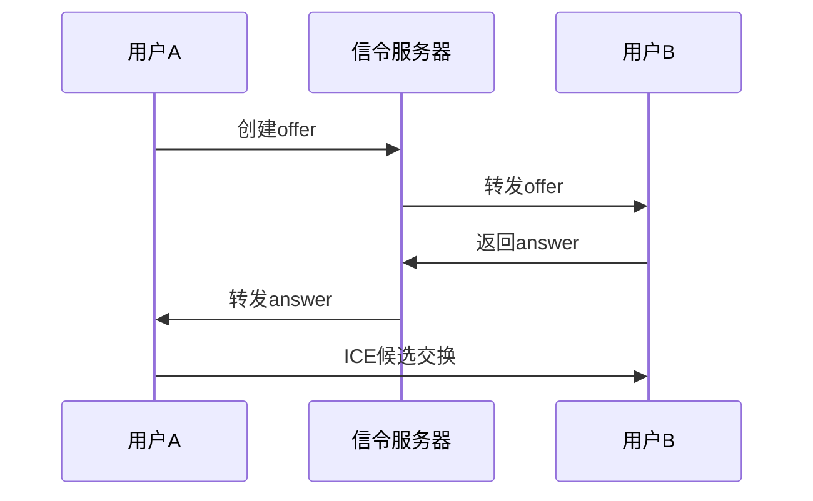

### 技术栈
- 后端: Node.js + Express + Socket.io
- 前端: WebRTC + Vanilla JavaScript
- 安全: HTTPS/SSL
- 网络协议: SDP/Session Description Protocol


### 核心功能
- [ ] 基于WebRTC的实时视频通信
- [ ] 信令服务器协调P2P连接
- [ ] 多客户端会话管理
- [ ] 安全加密传输(HTTPS)

## 项目结构说明
```bash
├── ssl/                # SSL证书目录（需自行生成）
├── public/             # 前端资源
│   ├── assets/         # 静态资源
│   ├── utils/          # 前端工具函数
│   ├── index.html      # 主页面
│   └── *.js            # 前端逻辑
├── server/             # 服务端模块
│   └── sdp.js          # 信令服务核心逻辑
├── utils/              # 通用工具库
└── index.js            # 服务入口文件
```

## 快速启动指南
### 环境要求
- Node.js v16+
- Chrome/Firefox 最新版

### 安装步骤
```bash
# 1. 安装依赖
npm i

# 2. 启动服务
nodemon index.js
```

### 访问地址
```text
https://localhost:3333/index.html
https://[你的IP]:3333/index2.html （用于跨设备测试）
```

## 核心模块解析

#### 1. 项目启动入口 index.js
```javascript
import express from "express";  
import fs from 'fs'  
import path from 'path'  
import https from 'https'  
import { Server } from 'socket.io'  
import { getIpAddress } from "./utils/common.js";  
// import { initSDPServer } from "./server/sdp.js";  
import { initSDPServer } from "./server/sdp2.js";  
// ssl证书  
const options = {  
  key: fs.readFileSync(path.resolve("./ssl/server.key")),  
  cert: fs.readFileSync(path.resolve("./ssl/server.crt"))  
}  
const app = express();// 搭建服务器  
app.use(express.static("./public"))  
const httpsServer = https.createServer(options, app);// 搭建Http服务  
const io = new Server(httpsServer, { allowEIO3: true, cors: true })  
initSDPServer(io);  
httpsServer.listen(3333, () => {  
  let str = getIpAddress() ? `https://${getIpAddress()}:3333` : `当前网络不可用`;  
  console.log(str);  
})
```

SSL安全配置
```javascript
const options = {   key: fs.readFileSync(path.resolve("./ssl/server.key")),  // 私钥文件   cert: fs.readFileSync(path.resolve("./ssl/server.crt"))  // 证书文件 }`
```
服务初始化流程  
```javascript  
// Express应用实例  
const app = express();  
  
// 静态资源托管（前端入口）  
app.use(express.static("./public"))   
// 创建HTTPS服务  
const httpsServer = https.createServer(options, app);  
  
// Socket.IO配置  
const io = new Server(httpsServer, {   
allowEIO3: true, // 兼容v2客户端  
  cors: { origin: "*" } // 跨域配置  
})  
  
// 初始化信令服务  
initSDPServer(io);  
  
// 启动监听  
httpsServer.listen(3333, () => {  
  const ip = getIpAddress();  console.log(ip ? `服务已启动: https://${ip}:3333` : '网络未连接');  
})  
```  
  
技术参数说明  

| 参数项          | 推荐值       | 注意事项                |  
|----------------|-------------|-----------------------|  
| 服务端口        | 3333        | 需防火墙放行           |  
| CORS配置        | origin: "*" | 生产环境应限制具体域名 |  
| Socket.IO版本   | v4+         | allowEIO3用于向下兼容  |  

 运行流程图解  

## 2.public/index.js
```javascript
import { createPeerConnection, createVideoEle, getLocalMediaStream, getLocalScreenMediaStream, setLocalVideoStream, setRemoteVideoStream } from "./utils/common.js";  
import { io } from "./utils/socket.io.esm.min.js"  
const roomInput = document.querySelector("#roomId")  
const userInput = document.querySelector("#userId")  
const startBtn = document.querySelector('.startBtn')  
const stopBtn = document.querySelector('.stopBtn')  
const videoBtn = document.querySelector('.videoBtn');  
const screenBtn = document.querySelector('.screenBtn');  
  
let offerVideo = document.querySelector('#offerVideo')  
  
let localStream = await getLocalMediaStream({ video: true, audio: true });// 本地音视频流  
setLocalVideoStream(offerVideo, localStream);  
  
// let isStopAudio = false;  
let isStopVideo = false;  
  
/**  
 * @type {RTCPeerConnection}  
 */  
let peer;  
let client; // socket对象  
let roomId;  
let userId;  
let isInited = false; // 第一次进入  
let isRoomFull = false; // 房间人数是否已满  
const serverUrl = "wss://172.17.117.149:3333/";// 服务器  
  
// 暂停与恢复通话  
stopBtn.addEventListener('click', () => {  
  if (peer) {  
    isStopAudio = !isStopAudio;  
    isStopVideo = !isStopVideo;  
    peer.getSenders().find(sender => sender.track.kind === 'audio').track.enabled = !isStopAudio  
    peer.getSenders().find(sender => sender.track.kind === 'video').track.enabled = !isStopVideo  
  }  
})  
  
// 屏幕共享之后，点击有切回视频通话  
videoBtn.addEventListener("click", async () => {  
  let newStream = await getLocalMediaStream({ video: true, audio: true });  
  if (newStream) {  
    localStream = newStream  
    setLocalVideoStream(offerVideo, localStream);  
    // 让通话用户也接收到实时的画面  
    localStream.getVideoTracks().forEach(track => {  
      peer.getSenders().find(sender => sender.track.kind === 'video').replaceTrack(track)  
    })  
  }  
})  
  
// 屏幕共享  
screenBtn.addEventListener("click", async () => {  
  // 拿到了屏幕流  
  let newStream = await getLocalScreenMediaStream({  
    video: {  
      cursor: 'always' | 'motion' | 'never',  
      displaySurface: 'application' | 'browser' | 'monitor' | 'window'  
    }  
  });  
  if (newStream) {  
    localStream = newStream  
    setLocalVideoStream(offerVideo, localStream);  
    // 让通话用户也接收到实时的画面  
    localStream.getVideoTracks().forEach(track => {  
      peer.getSenders().find(sender => sender.track.kind === 'video').replaceTrack(track)  
    })  
  }  
  
})  
  
  
// 开始通话  
startBtn.addEventListener('click', async () => {  
  if (isRoomFull) {  
    alert("当前房间人数已满");  
    return  
  }  
  roomId = roomInput.value;  
  userId = userInput.value;  
  
  if (!client) {  
    client = new io(serverUrl, {  
      reconnectDelayMat: 10000,  
      transports: ["websocket"],  
      query: {//传递给后端的参数  
        roomId,  
        userId  
      }  
    });  
  }  
  // 与后端的WebSocket建立了连接  
  client.on("connect", () => {  
    console.log("Connection successful!");  
  })  
  client.on("disconnect", () => {// 连接未启动  
    console.log("Connection disconnect!");  
  })  
  client.on("error", () => {//出错  
    console.log("Connection error!");  
  })  
  client.on('room-msg', (data) => {  
    console.log(data);  
  })  
  // 后端发来的消息，  
  client.on('people-count-msg', async (count) => {  
    console.log("count:" + count);  
    if (count === 1) {  
      isInited = true  
    }  
    peer = createPeerConnection();// 创建Peer对象  
    // 将本地的音视频轨道放到peer对象中  
    localStream.getTracks().forEach(track => {  
      peer.addTrack(track, localStream)  
    });  
    /**  
     * 拿到candidate候选信息,只有媒体协商完成之后才会触发  
     * @param {RTCPeerConnectionIceEvent} event   
*/  
    peer.onicecandidate = (event) => {  
      // console.log("candidate", event.candidate);  
      if (event.candidate) {  
        client.emit("candidate-msg", event.candidate)  
      }    }  
    /**  
     * 媒体协商和网络协商都完成了，A和B之间的通信就打通了  
     * A将自己本地的视频流传给B，B也会将自己的视频流传给A  
     * @param {RTCTrackEvent} event   
*/  
    peer.ontrack = (event) => {  
      // P2P连接成功  
      // 获取对方的音视频信息，然后设置给video元素  
      console.log("5. AB连接成功");  
      let videoEle = createVideoEle(count);  
      setRemoteVideoStream(videoEle, event.track)  
    }    if (!isInited) {// 第一个人进入时，不用发送offer  
      let offerSDP = await peer.createOffer()  
      await peer.setLocalDescription(offerSDP)  
      console.log("1. B 发送 offer")  
      client.emit("offer-sdp-msg", offerSDP);  
    }  
    isInited = true  
  })  
  client.on("room-full", () => {  
    alert("当房间人数已经满了")  
    isRoomFull = true  
    return  })  
  // 下面在进行媒体协商  
  // A收到B的sdp  
  client.on('offer-sdp-msg', async (offerSDP) => {  
    await peer.setRemoteDescription(offerSDP)  
    let answerSDP = await peer.createAnswer();  
    await peer.setLocalDescription(answerSDP)  
    console.log("2. A接收到B的offer, 并发送answer");  
    client.emit("answer-sdp-msg", answerSDP)// 信令服务器转发A的answerSDP给B  
  })  
  // B收到A的answerSdp  
  client.on('answer-sdp-msg', async (answerSDP) => {  
    await peer.setRemoteDescription(answerSDP);  
    console.log("3.B接收到A的answer, 存起来");  
  })  
  // 交换candiate信息  
  client.on('candidate-msg', async (candidate) => {  
    console.log("4.* 交换candidate信息");  
    await peer.addIceCandidate(candidate)  
  })  
  client.on('client-leave', (data) => {  
    console.log(data);  
  })  
})
```
#### 文件定位  
 
- **文件路径**: /public/index.js  
- **核心作用**: 视频通话主控逻辑  
- 功能模块：  
  - 本地媒体流管理  
  - WebRTC连接控制  
  - 屏幕共享切换  
  - Socket.io事件交互  

#### 架构图  

  
#### 核心变量说明  
| 变量名       | 类型                | 作用描述                  |  
|-------------|--------------------|-------------------------|  
| `peer`      | RTCPeerConnection | WebRTC连接实例           |  
| `client`    | Socket.io Client   | 信令服务器连接对象        |  
| `localStream` | MediaStream       | 本地音视频流            |  
| `isRoomFull` | Boolean           | 房间人数限制状态标记      |  
  
#### 功能模块详解  
  
媒体控制模块  
```javascript  
// 音频/视频切换逻辑  
stopBtn.addEventListener('click', () => {  
  if (peer) {    isStopAudio = !isStopAudio;    isStopVideo = !isStopVideo;    // 动态切换轨道状态  
    peer.getSenders().find(...).track.enabled = ...  }  
})  
  
// 屏幕共享实现  
screenBtn.addEventListener("click", async () => {  
  newStream = await getLocalScreenMediaStream(...)  // 轨道替换逻辑  
  peer.getSenders().find(...).replaceTrack(...)})  
```  
  
**功能对照表**：  

| 按钮        | 功能      | 关键技术点                 |
| --------- | ------- | --------------------- |
| stopBtn   | 通话静音/恢复 | `track.enabled`属性切换   |
| videoBtn  | 摄像头画面切换 | 媒体流重新获取               |
| screenBtn | 屏幕共享    | `getDisplayMedia` API |
  
WebRTC连接流程  
```javascript  
// 典型连接过程  
client.on('people-count-msg', async (count) => {  
  peer = createPeerConnection();  // 添加本地轨道  
  localStream.getTracks().forEach(track => peer.addTrack(track));    // ICE候选收集  
  peer.onicecandidate = (event) => {    client.emit("candidate-msg", event.candidate)  }  // 远端轨道处理  
  peer.ontrack = (event) => {    createVideoEle().srcObject = event.streams[0]  }})  
```  
  
信令交换时序  

关键事件处理  

| Socket.io事件      | 触发条件         | 处理逻辑              |     |
| ---------------- | ------------ | ----------------- | --- |
| people-count-msg | 房间人数变化       | 初始化PeerConnection |     |
| offer-sdp-msg    | 收到Offer SDP  | 创建Answer并回传       |     |
| answer-sdp-msg   | 收到Answer SDP | 设置远端描述            |     |
| candidate-msg    | ICE候选信息      | 添加ICE候选           |     |
| room-full        | 房间满员         | 阻止新连接             |     |

## 3. public/index2.js

### 1. 媒体流处理

#### getLocalMediaStream(constraints)
获取本地音视频流

**参数:**
- `constraints` {Object} - 媒体约束条件
  - `video` {Boolean|Object} - 视频约束
  - `audio` {Boolean|Object} - 音频约束

**返回值:**
- `Promise<MediaStream>` - 本地媒体流

#### getLocalScreenMediaStream(constraints)
获取本地屏幕共享流

**参数:**
- `constraints` {Object} - 屏幕共享约束
  - `video` {Object} - 视频约束配置
    - `cursor` {String} - 光标显示方式
    - `displaySurface` {String} - 显示表面类型

**返回值:**
- `Promise<MediaStream>` - 屏幕共享流

#### setLocalVideoStream(videoElement, stream)
设置本地视频流到视频元素

**参数:**
- `videoElement` {HTMLVideoElement} - 视频DOM元素
- `stream` {MediaStream} - 媒体流

#### setRemoteVideoStream(videoElement, track)
设置远程视频流到视频元素

**参数:**
- `videoElement` {HTMLVideoElement} - 视频DOM元素
- `track` {MediaStreamTrack} - 媒体轨道
### 2. WebRTC连接

#### createPeerConnection()
创建一个RTCPeerConnection对象

**返回值:**
- `RTCPeerConnection` - WebRTC对等连接对象

#### createVideoEle(id)
创建一个视频元素

**参数:**
- `id` {String} - 用户ID，用作视频元素标识

**返回值:**
- `HTMLVideoElement` - 创建的视频元素

### 二、Socket.io事件API

### 客户端监听事件

#### 1.connect
连接服务器成功时触发
#### 2.disconnect
与服务器断开连接时触发
#### 3.error
连接错误时触发

#### 4.room-msg
接收房间消息

**参数:**
- `data` {Object} - 房间消息内容
#### 5.answer-sdp-msg
接收对方发送的answer SDP信息

**参数:**
- `data` {Object} - SDP信息
  - `fromUserId` {String} - 发送方用户ID
  - `toUserId` {String} - 接收方用户ID
  - `sdp` {RTCSessionDescription} - SDP描述对象

#### 6.candidate-msg
接收ICE候选信息

**参数:**
- `data` {Object} - 候选信息
  - `fromUserId` {String} - 发送方用户ID
  - `toUserId` {String} - 接收方用户ID
  - `candidate` {RTCIceCandidate} - ICE候选对象

#### 7.client-leave
用户离开房间时触发

**参数:**
- `data` {Object} - 离开的用户信息

#### 8.user-id-list-msg
接收房间用户列表信息

**参数:**
- `userIdList{Array<String>}`房间内所有用户ID列表

### 客户端发送事件

#### 1.offer-sdp-msg
发送offer SDP信息

**参数:**
- `Object`
  - `fromUserId` {String} - 发送方用户ID
  - `toUserId` {String} - 接收方用户ID
  - `sdp` {RTCSessionDescription} - SDP描述对象

#### 2.answer-sdp-msg
发送answer SDP信息

**参数:**
- `Object`
  - `fromUserId` {String} - 发送方用户ID
  - `toUserId` {String} - 接收方用户ID
  - `sdp` {RTCSessionDescription} - SDP描述对象

#### 3.candidate-msg
发送ICE候选信息

**参数:**
- `Object`
  - `fromUserId` {String} - 发送方用户ID
  - `toUserId` {String} - 接收方用户ID
  - `candidate` {RTCIceCandidate} - ICE候选对象
### 六、工作流程

1. 用户连接时加入指定房间
2. 向用户和房间内其他成员发送更新后的用户列表
3. 转发WebRTC所需的各类信令（offer、answer、candidate）
4. 处理用户断开连接时的清理工作
## 4.sdp2.js

### 一、模块概述

`server/sdp2.js`文件实现了一个基于Socket.io的WebRTC信令服务器，支持多用户视频通话场景，负责转发用户间的信令消息并管理房间内的用户列表。

### 二、数据结构

### roomMap
**类型:** `Map<string, Set<string>>`

房间信息存储结构，其中：
- `key`: 房间ID字符串
- `value`: 保存该房间中所有用户ID的Set集合

### 三、导出函数

### initSDPServer(io)
初始化Socket.io信令服务器

**参数:**
- `io` {Server} - Socket.io服务器实例

### 四、内部函数

#### onEvent(socket)
初始化Socket事件监听，处理用户连接和消息转发

**参数:**
- `socket` {Socket} - Socket.io连接对象

### 五、Socket.io事件

#### 服务器监听事件

#### offer-sdp-msg
接收并转发offer SDP信息

**参数:**
- `data` {Object} - SDP信息
  - `fromUserId` {String} - 发送方用户ID
  - `toUserId` {String} - 接收方用户ID
  - `sdp` {RTCSessionDescription} - SDP描述对象

#### answer-sdp-msg
接收并转发answer SDP信息

**参数:**
- `data` {Object} - SDP信息
  - `fromUserId` {String} - 发送方用户ID
  - `toUserId` {String} - 接收方用户ID
  - `sdp` {RTCSessionDescription} - SDP描述对象

#### candidate-msg
接收并转发ICE候选信息

**参数:**
- `data` {Object} - 候选信息
  - `fromUserId` {String} - 发送方用户ID
  - `toUserId` {String} - 接收方用户ID
  - `candidate` {RTCIceCandidate} - ICE候选对象

#### disconnect
用户断开连接时触发，处理用户离开房间逻辑

### 服务器发送事件

#### user-id-list-msg
向房间内所有用户发送当前房间用户列表

**数据:**
- `Array<String>` - 房间内所有用户ID列表

#### room-msg
向房间内其他用户通知新用户加入

**数据:**
- `String` - 提示消息

#### client-leave
向房间内其他用户通知有用户离开

**数据:**
- `String` - 离开用户的ID和状态信息


## 6. util/common.js
### WebRTC通信工具库API文档

#### 一、模块概述

`utils/common.js` 文件提供了WebRTC通信项目所需的通用工具函数，主要用于网络相关操作，如获取本机IP地址等基础功能。

#### 二、导出函数

### getIpAddress()
获取本机IP地址，用于网络通信配置

**功能描述:**
- 通过系统网络接口信息获取本机IPv4地址
- 会过滤回环地址(127.0.0.1)和内部接口
- 返回第一个找到的有效外部IPv4地址

**参数:**
- 无参数

**返回值:**
- `{string|boolean}` - 成功则返回IP地址字符串，失败则返回false

#### 三、使用方法

```javascript
import { getIpAddress } from './utils/common.js';

// 获取本机IP地址
const myIpAddress = getIpAddress();
if (myIpAddress) {
  console.log(`本机IP地址: ${myIpAddress}`);
} else {
  console.log('无法获取有效IP地址');
}
```


### 三、使用流程

1. 建立socket.io连接，并加入房间
2. 监听房间用户列表信息
3. 创建RTCPeerConnection对象
4. 执行媒体协商（交换SDP）
5. 执行网络协商（交换ICE候选）
6. 建立P2P连接并传输媒体流

### 扩展建议
- [ ] 添加房间管理系统
- [ ] 增加文字聊天通道
- [ ] 实现屏幕共享功能
- [ ] 添加连接状态监控

## 附录
### 技术关键词解释
- **WebRTC**: Web实时通信技术标准
- **SDP**: 会话描述协议，用于媒体协商
- **ICE**: 交互式连接建立协议，用于NAT穿透

### 相关资源
- [WebRTC官方文档](https://webrtc.org/)
- [Socket.io信令实现指南](https://socket.io/docs/v4/)
- [SSL证书生成教程](https://letsencrypt.org/docs/)
