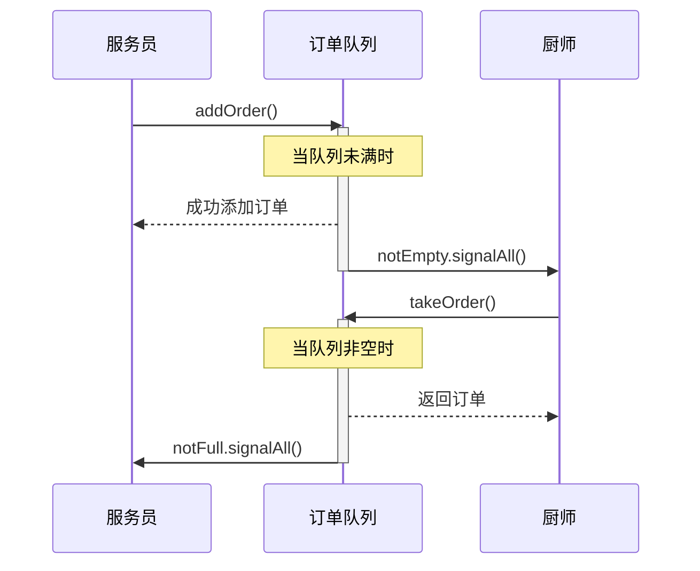

```java
private final Condition notEmpty = lock.newCondition();
private final Condition notFull = lock.newCondition();
```
orderQueue中加了这一段之后，addorder和takeorder应该怎么改才能让厨师开始处理？


你需要通过正确使用 **`Condition` 对象的等待/通知机制** 来协调服务员和厨师线程的协作。以下是具体修改方案：

---

### **一、`OrderQueue` 类修改**
```java
class OrderQueue {
    private final Queue<Order> queue = new LinkedList<>();
    private final int maxSize;
    private final ReentrantLock lock = new ReentrantLock();
    // 定义两个Condition分别控制队列满和空的状态
    private final Condition notFull = lock.newCondition();  // 队列未满条件
    private final Condition notEmpty = lock.newCondition(); // 队列非空条件

    public OrderQueue(int maxSize) {
        this.maxSize = maxSize;
    }

    // 修改后的 addOrder 方法
    public void addOrder(Order order) throws InterruptedException {
        lock.lock();
        try {
            // 循环检查队列是否已满 (必须用 while 避免虚假唤醒)
            while (queue.size() >= maxSize) {
                System.out.println("队列已满，服务员等待...");
                notFull.await(); // 在 notFull 条件上等待
            }
            queue.offer(order);
            System.out.println("新订单加入队列: " + order);
            notEmpty.signalAll(); // 添加订单后唤醒等待 notEmpty 的厨师线程
        } finally {
            lock.unlock();
        }
    }

    // 修改后的 takeOrder 方法
    public Order takeOrder() throws InterruptedException {
        lock.lock();
        try {
            // 循环检查队列是否为空
            while (queue.isEmpty()) {
                System.out.println("队列为空，厨师等待...");
                notEmpty.await(); // 在 notEmpty 条件上等待
            }
            Order order = queue.poll();
            notFull.signalAll(); // 取出订单后唤醒等待 notFull 的服务员线程
            return order;
        } finally {
            lock.unlock();
        }
    }
}
```

---

### **二、修改后的线程协作流程**


---

### **三、关键修改点说明**
1. **双条件分离**：
   - `notFull`：控制队列是否还能添加新订单
   - `notEmpty`：控制队列是否有订单待处理

2. **精准通知**：
   - **添加订单后**：通过 `notEmpty.signalAll()` **唤醒等待处理订单的厨师**
   - **取出订单后**：通过 `notFull.signalAll()` **唤醒等待添加订单的服务员**

3. **防御性循环检查**：
   ```java
   while (queue.size() >= maxSize) // 用 while 而不是 if
   ```
   - 防止 **虚假唤醒（Spurious Wakeup）** 导致逻辑错误
   - 符合 Java 并发编程规范要求

---

### **四、常见问题调试**
#### **问题1：厨师线程无法启动处理**
**症状**：服务员添加订单但厨师无反应  
**排查**：
1. 检查 `notEmpty.signalAll()` 是否在添加订单后被调用
2. 确认厨师线程的 `isRunning` 是否初始化为 `true`

#### **问题2：线程死锁**
**症状**：所有线程卡住不动  
**解决方案**：
```java
// 设置等待超时时间
notFull.await(5, TimeUnit.SECONDS);
notEmpty.await(5, TimeUnit.SECONDS);
```
并添加超时后的处理逻辑

---

### **五、性能优化建议**
1. **使用 signal() 代替 signalAll()**  
   当确定每次操作只能唤醒一个线程时（如单生产者单消费者模式），改用：
   ```java
   notEmpty.signal(); // 替代 signalAll() 减少上下文切换
   ```

2. **公平锁配置**  
   在 **高竞争场景** 下启用公平锁：
   ```java
   private final ReentrantLock lock = new ReentrantLock(true); 
   ```

---

通过以上修改，服务员和厨师线程将能够正确协同工作：当订单被加入队列时，厨师线程会被及时唤醒处理；当队列有空间时，服务员线程会被唤醒继续添加新订单。