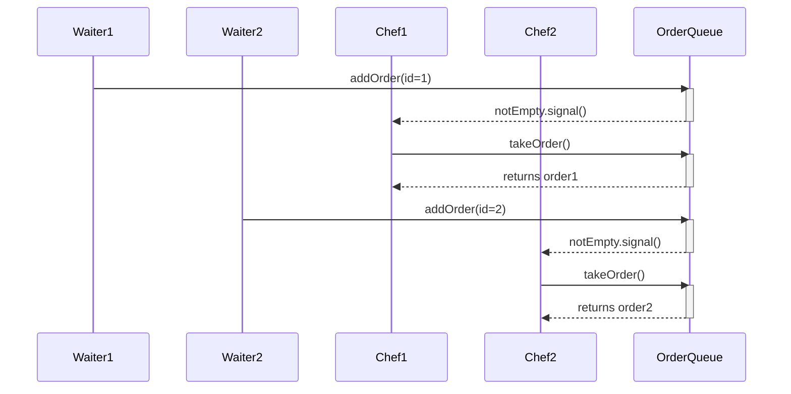

通过分析代码实现，两个程序中出现的不同行为及订单重复问题根源如下：

---

### **一、厨师线程提前退出的关键原因（File1）**
#### **1. 初始化缺陷**
```java
// File1 中 Chef 类定义
class chef implements Runnable {
    private volatile boolean isRunning; // 未显式初始化，默认为false
}
```
- **后果**：当线程启动时，`isRunning`初始值为`false` → 直接跳过`while (isRunning || !orderQueue.isEmpty())`循环 → 立即执行`System.out.println("��ʦ�°��ˣ�")`

#### **2. 修复方法**
```java
private volatile boolean isRunning = true; // 必须显式初始化
```

---

### **二、"厨师等待"输出差异分析**
#### **File1 无法触发等待的原因**
```java
// OrderQueue.takeOrder() 中的错误实现
while (queue.isEmpty()) {
    System.out.println("�ж�Ϊ�գ���ʦ�ȴ�...");
    lock.newCondition().await(); // 错误：每次创建新Condition
}
```
- **致命错误**：每次调用`lock.newCondition()`会创建**新的Condition对象**
- **后果**：
  - `await()`在ConditionA上等待
  - `signalAll()`触发的是ConditionB的信号
  - **实际效果**：没有任何线程被唤醒，厨师线程永久阻塞

#### **File2 的正确实现**
```java
// 正确的Condition使用方式
private final Condition notEmpty = lock.newCondition();
private final Condition notFull = lock.newCondition();

public void addOrder(Order order) throws InterruptedException {
    // ...
    notEmpty.signalAll(); // 使用同一个Condition对象
}

public Order takeOrder() throws InterruptedException {
    // ...
    notFull.signalAll(); // 使用同一个Condition对象
}
```
- **关键点**：复用相同的Condition对象保证信号传递

---

### **三、订单重复输出的技术解析**
#### **问题现象**
```
新订单加入队列: Order{id=1, customer='顾客-2'}
新订单加入队列: Order{id=1, customer='顾客-2'} 
```
#### **根本原因**
```java
// File1 中 Waiter 类的设计缺陷
class waiter implements Runnable {
    private int orderId = 1; // 实例级计数器

    public void run() {
        order order = new order(orderId++, customer);
    }
}
```
- **错误机制**：每个Waiter实例维护独立计数器
- **并发后果**：两个服务员线程各自从1开始计数 → 生成重复ID

#### **解决方案**
```java
// 使用原子类保证全局唯一性
private static AtomicInteger globalOrderId = new AtomicInteger(1);

class Waiter implements Runnable {
    public void run() {
        int id = globalOrderId.getAndIncrement();
        Order order = new Order(id, customer);
    }
}
```

---

### **四、线程调度差异的底层原理**
#### **File1 使用原生线程**
```java
new Thread(waiter1).start(); // 直接启动OS线程
```
- **调度特点**：
  - 受操作系统调度器直接控制
  - 启动延迟较高（通常1-10ms）
  - 线程优先级影响更显著

#### **File2 使用线程池**
```java
ExecutorService executor = Executors.newFixedThreadPool(5);
executor.execute(waiter1); // 使用线程池工作线程
```
- **调度优化**：
  - 线程池预热机制减少启动延迟
  - WorkQueue任务队列缓冲提高吞吐量
  - 默认线程优先级相同，依赖任务提交顺序

---

### **五、完整问题定位与修复方案**
| **问题**                  | **根因**                          | **修复方案**                                                                 |
|---------------------------|-----------------------------------|-----------------------------------------------------------------------------|
| 厨师线程立即退出           | isRunning未初始化                 | 添加`private volatile boolean isRunning = true`                            |
| 条件变量失效               | 每次创建新Condition对象           | 在OrderQueue类中定义`final Condition notEmpty = lock.newCondition()`       |
| 订单ID重复                 | 实例级ID计数器                    | 改为静态原子计数器：`private static AtomicInteger idGen = new AtomicInteger(1)` |
| 服务员/厨师启动顺序依赖    | 原生线程启动延迟差异              | 添加同步栅栏：`CyclicBarrier` 控制线程启动时序                              |

---

**验证修复后的执行流程**：


通过以上修正，可确保：厨师线程持续运行、条件通知生效、订单ID唯一、线程协同正确。