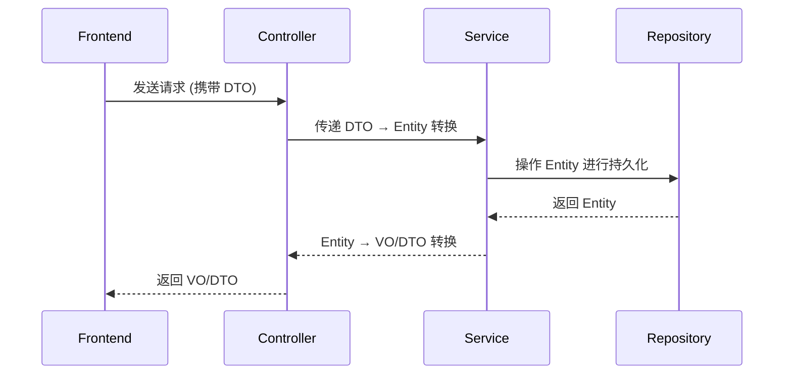

在 Spring 或 Java 分层架构中，常见的数据对象类型包括 **DTO、Entity、VO、POJO** 等。它们的核心区别在于 **用途** 和 **生命周期**，以下是详细对比：

---

### 1. **Entity（实体类）**
#### **作用**
- 直接对应数据库表结构，用于 **数据持久化**。
- 通常与 JPA/Hibernate 的 `@Entity` 注解配合使用。
#### **特点**
- 包含数据库字段的完整映射（如 `@Column`）。
- 可能包含关联关系（如 `@OneToMany`）。
- **不应暴露给前端**，防止数据库结构泄露。
#### **示例**
```java
@Entity
public class User {
    @Id
    @GeneratedValue(strategy = GenerationType.IDENTITY)
    private Long id;
    private String username;
    private String password;  // 敏感信息，不应暴露
    // Getters & Setters
}
```

---

### 2. **DTO（Data Transfer Object，数据传输对象）**
#### **作用**
- **跨层数据传输**，如 Controller 与 Service 层之间的数据传递。
- 隐藏敏感字段（如密码），或组合多个 Entity 的数据。
#### **特点**
- 仅包含 **必要字段**，与业务场景强相关。
- 无业务逻辑，纯粹的数据容器。
- 常用于 **接收请求参数** 或 **返回响应结果**。
#### **示例
```java
public class UserDTO {
    private String username;
    private String email;
    // 不包含 password 字段
    // Getters & Setters
}
```

---

### 3. **VO（View Object，视图对象）**
#### **作用**
- 为前端展示定制数据格式，适合 **响应结果封装**。
- 可能包含计算后的字段（如状态码、格式化后的日期）。
#### **特点**
- 结构与前端需求完全匹配。
- 字段可能来自多个 Entity 或 DTO 的组合。
#### **示例
```java
public class UserVO {
    private String username;
    private String displayName;
    private String formattedCreateTime;  // 格式化后的时间
    // Getters & Setters
}
```

---

### 4. **POJO（Plain Old Java Object，简单 Java 对象）**
#### **作用**
- 泛指 **不依赖框架** 的普通 Java 对象。
- 可视为 DTO、VO、Entity 的基类概念。
#### **特点**
- 只有属性和 getter/setter 方法。
- 不包含业务逻辑或框架注解。
#### **示例
```java
public class SimpleUser {
    private String name;
    private int age;
    // Getters & Setters
}
```

---

### 核心区别与联系

| 类型      | 用途                      | 生命周期         | 依赖框架？       | 是否暴露给前端？ |
|-----------|--------------------------|------------------|------------------|------------------|
| Entity    | 数据库持久化              | DAO/Repository层 | 是（如 JPA）     | 否               |
| DTO       | 跨层数据传输              | Controller↔Service | 否              | 是（请求/响应）  |
| VO        | 前端展示定制              | Controller→前端   | 否              | 是（响应）       |
| POJO      | 通用数据容器（基类概念）   | 所有层           | 否              | 依场景而定       |

---

### 典型数据流


---

### 为什么需要多种数据对象？
1. **安全性**  
   Entity 隐藏敏感字段（如 `password`），DTO/VO 仅暴露必要信息。
2. **解耦**  
   修改数据库表结构（Entity）不会直接影响前端接口（DTO/VO）。
3. **灵活性**  
   VO 可根据前端需求自由组合字段，Entity 保持与数据库一致。
4. **性能优化**  
   DTO 可减少网络传输的数据量（如省略关联表的大字段）。

---

### 实际开发中的工具
- **对象转换工具**：简化 Entity/DTO/VO 之间的转换（如 MapStruct、ModelMapper）。
- **Lombok**：通过 `@Data` 自动生成 getter/setter，减少样板代码。