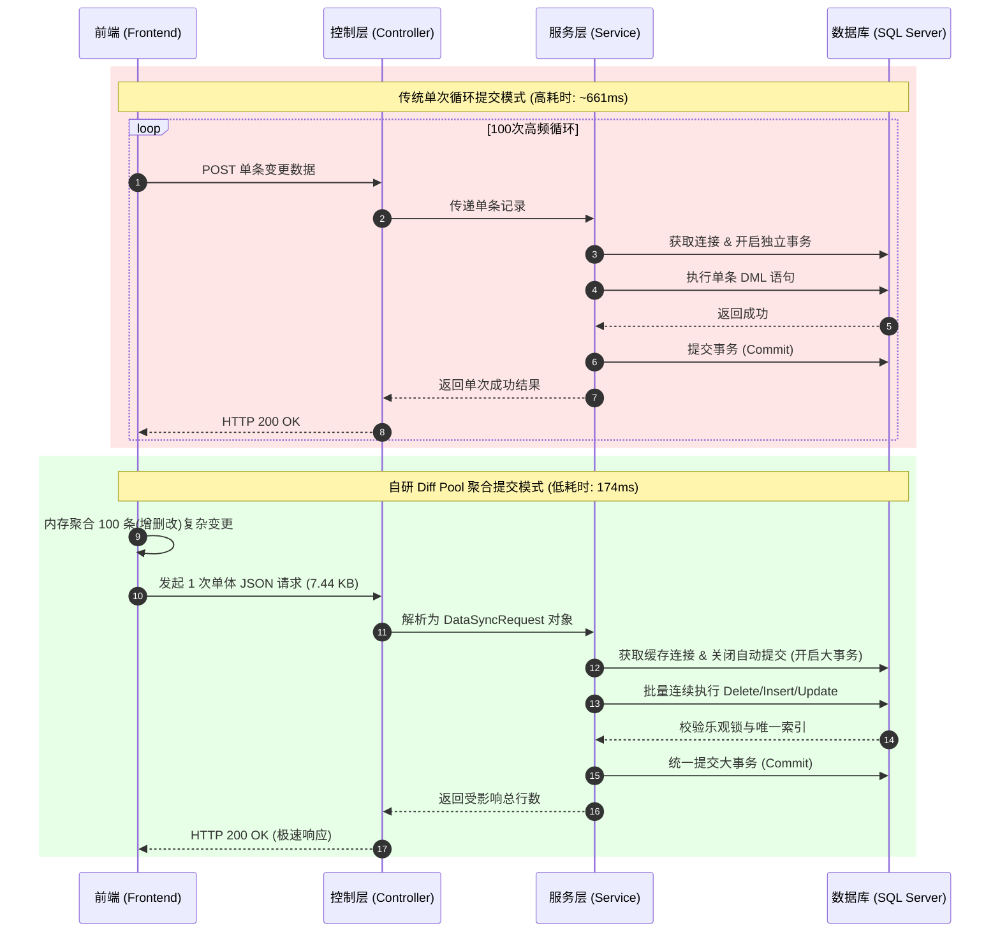

```mermaid
sequenceDiagram
    autonumber
    participant F as 前端 (Frontend)
    participant C as 控制层 (Controller)
    participant S as 服务层 (Service)
    participant DB as 数据库 (SQL Server)

    rect rgb(255, 230, 230)
    Note over F,DB: 传统单次循环提交模式 (高耗时: ~661ms)
    loop 100次高频循环
        F->>C: POST 单条变更数据
        C->>S: 传递单条记录
        S->>DB: 获取连接 & 开启独立事务
        S->>DB: 执行单条 DML 语句
        DB-->>S: 返回成功
        S->>DB: 提交事务 (Commit)
        S-->>C: 返回单次成功结果
        C-->>F: HTTP 200 OK
    end
    end

    rect rgb(230, 255, 230)
    Note over F,DB: 自研 Diff Pool 聚合提交模式 (低耗时: 174ms)
    F->>F: 内存聚合 100 条(增删改)复杂变更
    F->>C: 发起 1 次单体 JSON 请求 (7.44 KB)
    C->>S: 解析为 DataSyncRequest 对象
    S->>DB: 获取缓存连接 & 关闭自动提交 (开启大事务)
    S->>DB: 批量连续执行 Delete/Insert/Update
    DB-->>S: 校验乐观锁与唯一索引
    S->>DB: 统一提交大事务 (Commit)
    S-->>C: 返回受影响总行数
    C-->>F: HTTP 200 OK (极速响应)
    end
```