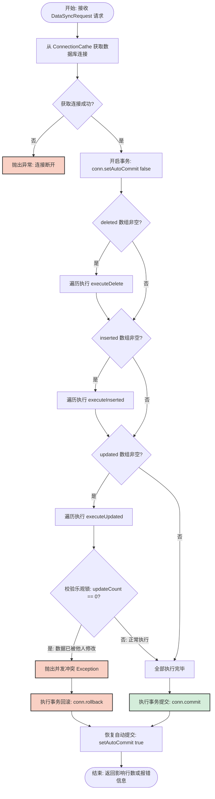

```mermaid
graph TD
    A([开始: 接收 DataSyncRequest 请求]) --> B[从 ConnectionCathe 获取数据库连接]
    B --> C{获取连接成功?}
    C -- 否 --> D[抛出异常: 连接断开]
    
    C -- 是 --> E[开启事务: conn.setAutoCommit false]
    E --> F{deleted 数组非空?}
    
    F -- 是 --> F1[遍历执行 executeDelete] --> G
    F -- 否 --> G{inserted 数组非空?}
    
    G -- 是 --> G1[遍历执行 executeInserted] --> H
    G -- 否 --> H{updated 数组非空?}
    
    H -- 是 --> H1[遍历执行 executeUpdated]
    H -- 否 --> L[全部执行完毕]
    
    H1 --> I{校验乐观锁: updateCount == 0?}
    
    I -- 是: 数据已被他人修改 --> J[抛出并发冲突 Exception]
    J --> K[执行事务回滚: conn.rollback]
    
    I -- 否: 正常执行 --> L
    L --> M[执行事务提交: conn.commit]
    
    K --> N[恢复自动提交: setAutoCommit true]
    M --> N
    
    N --> O([结束: 返回影响行数或报错信息])

    %% 节点样式设置 (你可以不用管，让图更好看)
    classDef error fill:#f9d0c4,stroke:#333,stroke-width:2px;
    classDef success fill:#d4edda,stroke:#333,stroke-width:2px;
    class J,K,D error;
    class M success;
```